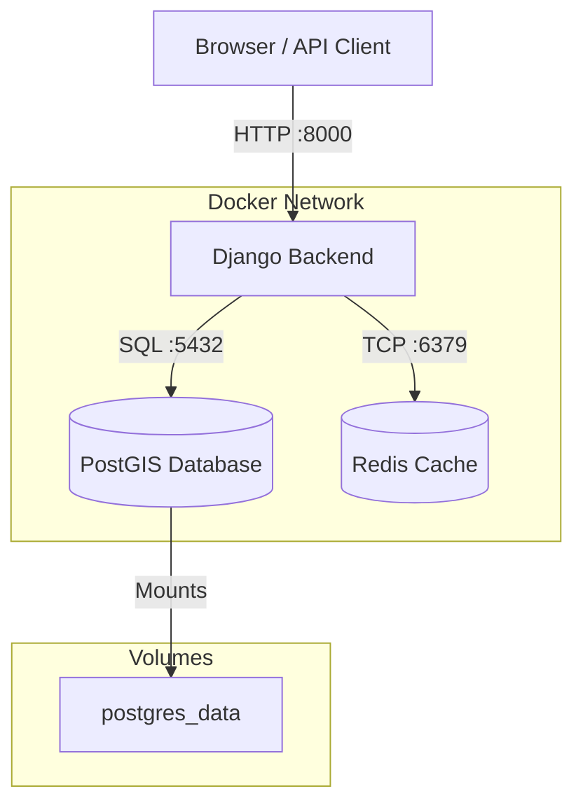

# System Architecture

## Overview
The **Public Office Register** is a containerized web application designed to track public officials, organizations, and their tenure. It is built on a "Schema-First" philosophy using the Popolo open data standard.

## Technology Stack

| Component | Technology | Purpose |
|-----------|------------|---------|
| **Backend** | Python 3.10 + Django 4.x | REST API & Admin Interface |
| **Database** | PostgreSQL 15 + PostGIS | Relational data & Geospatial queries |
| **Cache** | Redis | Session storage & API caching |
| **Frontend** | React + TypeScript (Vite) | User Interface (Planned Phase 2) |
| **Infra** | Docker Compose | Local development orchestration |

## Container Architecture

The application runs as a set of isolated Docker services orchestrated by Docker Compose.

## Directory Structure

* **`backend/`**: The Django source code.
    * **`config/`**: Project-wide settings (URL routing, WSGI).
    * **`apps/`**: Modular Django applications.
        * **`core/`**: Shared abstract models (UUIDs, timestamps, soft-delete).
        * **`registry/`**: Popolo-compliant models (Person, Org, Post, Membership).
    * **`Dockerfile`**: Defines the Python/GDAL runtime environment.
* **`frontend/`**: The React application root (Currently a placeholder for Phase 5).
* **`.github/`**: CI/CD workflows.
    * **`ci.yml`**: Runs linting (Ruff/Black) and tests (Pytest).
    * **`docker-build.yml`**: Verifies container build integrity.
* **`docs/`**: Project documentation and architectural decisions.

## CI/CD Pipeline

1.  **Linting**: `ruff` checks for code quality and bugs.
2.  **Formatting**: `black` ensures style consistency.
3.  **Testing**: Native Django `test` suite runs against a temporary PostGIS service.
4.  **Build Check**: Verifies that the Docker images build successfully to prevent deployment failures.    

---